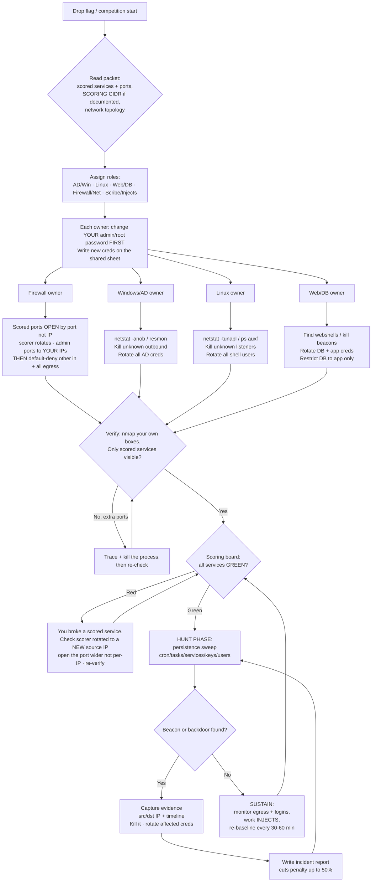

# CCDC Blue-Team Defense Playbook

> **Purpose:** A single field manual for locking down Windows/AD, Linux, web apps, and firewalls at competition start — blocking red-team C2/beacons **without** ever blocking the scoring engine. Includes a minute-by-minute runbook, per-platform checklists, a persistence-hunting guide, an injects/unknown-services plan, and a flowchart to follow.
>
> Built from verified research (official CCDC rules PDFs, Microsoft Learn, DSInternals, first-hand red-team writeups, community prep repos). See **Sources** at the bottom. Adapt every IP/port/hostname to your actual team packet — nothing here is copy-paste-safe without checking your topology.

---

## 0. The One Rule That Beats Everything

**Never block the scoring engine. Ever.**

Per the official CCDC rules (MACCDC/CAE-EP): *"Any firewall rule, IDS, IPS, or defensive action that interferes with the functionality of the scoring engine or manual scoring checks are **exclusively the responsibility of the teams**."* If your firewall blocks the scoring poller, the service reads as **down** and you lose those points — the red team didn't even have to do anything.

### ⚠️ The scoring engine's source IP ROTATES — do NOT pin an allow rule to one IP
This is the single most important thing on this page. The scorer polls from **changing / multiple source IPs** (a pool, a NAT range, or deliberately rotated). Many teams lose the match by whitelisting the one IP they saw at start and then getting scored **down** the moment the poller rotates. Some competitions rotate *specifically* to punish naive IP-whitelisting.

**So the model is: filter by PORT and DIRECTION, not by scorer source IP.**

| Traffic | Rule | Why |
|---|---|---|
| **Inbound to a scored service port** (e.g. 443, 25, 3306) | **Allow from anywhere** (or from the documented scoring CIDR if — and only if — the packet guarantees the scorer stays inside it). **Never** pin to a single IP. | You can't predict the rotating source. Security here comes from **hardening the service + monitoring the port**, not from source-filtering. |
| **Inbound to admin/management ports** (SSH 22, RDP 3389, WinRM 5985/6) | **Allow only from your team's jump box / internal admin IPs.** | The scorer never needs these, so lock them tight — this is where source-IP whitelisting is correct. |
| **All other inbound** | **Default-deny.** | Shrink surface. |
| **Outbound / egress** | **Default-deny**, allow only required (DNS, updates). | Kills C2/beacons — independent of the scorer, so rotation doesn't affect it. |

**Rule of thumb:** *fail **open** on scored-service ports, fail **closed** on everything else.* Because the scored port must stay reachable to the world, the **service on it must be genuinely hardened** (patched, creds rotated, WAF/rate-limit, connection logging) — the firewall will not keep the red team off that port, so the service has to.

**Operational consequence, drilled into everyone:**
- Scored port = open (to scoring CIDR if documented, else all). Admin port = your IPs only. Everything else = denied. Egress = denied except essentials.
- **Learn the rotation pattern from logs**, don't guess it (see §0.1). If the packet documents a scoring subnet/CIDR, allow the **whole range**, never a host.
- After lockdown, run `nmap` against your own boxes: *you should see nothing that isn't a scored service or an admin port locked to your IPs.*

### §0.1 — Discover the scorer's source range before you lock down
Because you can't assume a single IP, spend the first minutes *observing* who legitimately hits your scored ports:
```bash
# Linux — watch live who is connecting to a scored port (e.g. 443)
ss -tn state established '( dport = :443 or sport = :443 )'
# or tail the service's own access log and extract source IPs
tail -f /var/log/nginx/access.log | awk '{print $1}'
```
```powershell
# Windows — live connections to a scored port
Get-NetTCPConnection -LocalPort 443 | Select RemoteAddress,State
```
Cross-reference against the **documented scoring subnet in your packet**. If the packet gives a CIDR, trust the CIDR (allow the whole range) over anything you infer. If it doesn't, keep the scored port open to all and rely on service hardening + monitoring — an open scored port is expected and safe *only if the service behind it is hardened*.

---

## 1. How Scoring Works (and why "availability wins")

CCDC is about **operating and defending an existing production network**, not just locking it down. Three ways to earn/lose points:

| You GAIN points by | You LOSE points by |
|---|---|
| Keeping required services **up** (scoring engine reaches them) | **SLA violations** (service down for N consecutive checks) |
| Preventing/controlling unauthorized access | Using **recovery services** (asking to restore a box) |
| Completing **business injects** (tasks/tickets) | **Successful Red Team penetrations** |

- **Service points and inject points are each roughly half** of the total.
- This is why **you cannot just unplug everything**. A dead-but-secure box loses as badly as a compromised one. Balance security against availability.
- **Incident reports cut red-team penalties by up to ~50%** — but only if thorough. See §8.

---

## 2. The Threat: What the Red Team Is Doing Right Now

Assume the worst from **minute zero** (a 2026 rule change reportedly removes the early exploitation delay — no grace period):

- **They have your docket.** Within an hour or two, the red team knows *every default password and configuration* — the same starting docket you have. *"We have your passwords figured out and documented probably before you even do."*
- **They race to plant persistence** across 10+ team networks **before you pull boxes to harden.** So beacons/backdoors likely **already exist** when you sit down.
- **C2 beacons call home** — shells beaconing to red-team C2 both inside and outside the competition network, often over **covert channels** (multiple GB over **NTP**, DNS traffic from a DC spiking to a non-real resolver). Teams routinely fail to notice this.
- **Beacons are resilient.** Cobalt Strike Beacon can call **multiple C2 IPs** and use **EC2 redirectors** that proxy/hide the true C2. **Blocking one IP does not cut the channel** — that's why you need default-deny egress, not a blocklist.
- **Databases turn the scoreboard red in seconds.** At NCCDC 2025, by end of day one *no team* had rotated all 4 sets of default DB creds or restricted DB access. DBs are high-value — treat them as priority.

**The winning counter-moves (in order):** rotate ALL credentials → shut down every unscored service → hunt existing beacons → default-deny firewall (scored ports open, admin ports locked to your IPs, egress denied) → sustain + injects.

### Mindset: Active Defense, not Incident Response
CCDC is **active defense** — you're engaging an adversary in real time, not doing forensics on a breach that's over. Don't chase evidence while you're still bleeding: **harden systems, filter traffic, and disable attack vectors first**, then investigate. Speed beats perfection in the first two hours — get the high-impact mitigations live, refine later. *(akshayrohatgi.com)*

### Vulnerability Prioritization — fix the right things first
When you find 20 problems in the first 15 minutes, triage with a simple score:

```
Priority = (Impact × Exploitability) / (Remediation Cost + 1)     # rate each 1–5
```

Hit **high-impact, easily-exploited, cheap-to-fix** first. Canonical top-priority items:
- **Default credentials** everywhere → rotate immediately (highest ROI).
- **EternalBlue / SMBv1** → disable SMBv1 (unauthenticated RCE).
- **ZeroLogon (CVE-2020-1472)** → a fully-patched DC is the real fix (it abuses Netlogon over RPC — "block port 139" is *not* the fix; 139/445 are NetBIOS/SMB).
- **Over-privileged domain users** → de-privilege non-essential Domain/Enterprise Admins.

"Complexity buys detection time" — removing the *easiest* paths first forces the red team into noisier techniques you can catch.

---

## 3. THE FLOWCHART — Follow This



> Rule of thumb for the whole diagram: **green scoreboard is the throttle.** Never make a change that could turn a service red without knowing exactly how to undo it in under a minute.

---

## 4. Minute-by-Minute Runbook (First Hour and Beyond)

Roles first. A 6–8 person team should split into: **AD/Windows**, **Linux**, **Web/DB**, **Firewall/Network**, and a **Scribe/Injects** lead (tracks the password sheet, incident reports, and inject tickets). Everyone works in parallel — the timeline below is **per-owner, concurrent**, not sequential.

### T+0 to T+5 — Orient (whole team)
- [ ] Read the packet. Write on a whiteboard/shared doc: **scored services + ports**, the **documented scoring CIDR (if any)** — remember the scorer's source IP **rotates**, so plan to open scored ports by *port*, not by a single IP — your subnets, your team admin subnet, box inventory, admin contacts.
- [ ] Assign owners. Open the **shared credential sheet** (offline — not on a scored box).
- [ ] **Map dependencies ("finding the monkey"):** for each scored service, trace what it depends on, recursively. *WordPress → AD auth → DB server → file server.* Knowing the chain stops one change from cascading a scored service offline. Do this **before** you start blocking/rotating.
- [ ] **Do NOT enable default-deny yet** — you haven't built the port rules or confirmed the scored ports answer.

### T+5 to T+15 — Change YOUR credentials first (all owners, in parallel)
The red team's #1 lever is default creds. Deny it immediately.
- [ ] **Each owner changes the admin/root password on the box(es) they own** and records it on the sheet. This buys you a locked front door while you do everything else.
- [ ] Windows: domain admin + local admins. Linux: root + any sudo user. DB: all DB accounts. Web: app admin panels.
- [ ] Note current logged-in sessions (`query user` / `who`) — a session you don't recognize is a live intruder.

### T+15 to T+35 — Triage & surface-reduction (parallel per platform)

**Firewall owner (highest leverage — do this fast):**
- [ ] Identify scored **ports** and the documented scoring **CIDR** (if any) from the packet. **The scorer's source IP rotates — do NOT pin to one IP (see §0).**
- [ ] Build rules by port/direction (see §6): **scored ports OPEN** (to the scoring CIDR if documented, else to all); **admin ports (22/3389/5985) locked to your team IPs**; **internal deps (DNS/AD) allowed**; **then default-deny remaining inbound AND all outbound.**
- [ ] Because scored ports stay open, **hardening the service behind them is what keeps the red team out** — patch + rotate creds + WAF/rate-limit + log the port.
- [ ] Egress is the C2 killer — Windows/most hosts allow **all outbound by default**, so C2 walks straight out until you deny it.

**Windows/AD owner:**
- [ ] `netstat -anob` and `resmon.exe` → list every listener + outbound connection. Screenshot/save.
- [ ] Kill/disable unknown services and unexpected outbound connections (note them for the incident report first).
- [ ] Disable unused features/roles; stop unscored services.

**Linux owner:**
- [ ] `netstat -tunapl` (or `ss -tunapl`) and `ps auxf` → enumerate listeners + processes.
- [ ] `crontab -l` for every user + `/etc/cron*`, `systemctl list-timers`, `systemctl list-units --type=service` → note anything unfamiliar.
- [ ] Stop unscored services.

**Web/DB owner:**
- [ ] Rotate DB creds (all sets) and app-admin creds.
- [ ] **If the DB is only an internal dependency** (scorer hits the web app, not the DB directly): restrict DB network access to the **app server only**. **If the DB port is itself scored** (scorer connects directly): keep it **open by port** (scorer rotates) and secure it with creds + `bind-address` + query logging instead. Check the packet to know which. DBs turn the board red fastest.
- [ ] Look for webshells (recently modified files in web root, unexpected `.php/.aspx/.jsp`) — but don't rely on mtime alone (attackers timestomp).

### T+35 to T+50 — Mass credential rotation & lockdown
- [ ] **Rotate ALL user credentials, not just admins.** Linux: mass-rotate every interactive-shell account except your designated user + root (script it — see BlueLinuxBastion `userkiller.sh`). Windows/AD: reset all domain user passwords, force change-on-logon where safe.
- [ ] Disable/lock unknown accounts. Remove backdoor accounts and rogue sudoers/Domain Admins.
- [ ] Rotate service-account and API creds where present.
- [ ] Firewall owner: **flip default-deny** now that the allowlist is built.

### T+50 to T+60 — Verify green
- [ ] `nmap` **your own** boxes: only scored services should answer.
- [ ] Check the **scoring board**: every scored service **GREEN**. If a service flips red *later*, suspect the **scorer rotated to a new source IP** your rules didn't expect — widen the scored port (by port, not per-IP), never add a single-IP exception. (Over-blocking the rotating scorer is the #1 self-inflicted point loss.)
- [ ] Confirm the scored **port** answers from *any* source, and that admin ports answer **only** from your IPs.

### T+60 onward — Hunt, then sustain (loop)
- [ ] **Persistence sweep** (see §7): cron/systemd timers, scheduled tasks, WMI subscriptions, services, SSH `authorized_keys`, startup items, new admins, GPO changes.
- [ ] **Egress watch:** baseline outbound volume + destinations. Flag NTP/DNS spikes and any outbound to unexpected IPs. A DC talking DNS to a non-corporate resolver = investigate.
- [ ] **Every beacon/backdoor found → capture evidence → kill → rotate affected creds → write incident report** (§8).
- [ ] **Work injects** — they're ~half the points. The Scribe keeps a ticket queue so hardening doesn't starve inject deadlines.
- [ ] **Re-baseline every 30–60 min.** Re-run netstat/ps, diff against your saved baseline. Persistence you missed will re-emerge.

---

## 5. Per-Platform Hardening Checklists

### 5A. Windows / Active Directory / Domain Controllers

**Credentials & accounts**
- [ ] Reset Domain Admin, built-in Administrator, all local admins, and (mass) all domain users.
- [ ] Enumerate & prune privileged groups: Domain Admins, Enterprise Admins, Administrators, Backup Operators. Remove anything you didn't put there.
- [ ] Disable/rename default accounts; check for hidden/rogue accounts (`net user`, `Get-ADUser -Filter *`).
- [ ] Check `AdminSDHolder`, ACLs, and delegation for backdoors if time allows.

**Services & surface**
- [ ] `netstat -anob`, `resmon.exe`, `Get-Service` → disable unscored/unknown services.
- [ ] Disable legacy protocols where not scored (SMBv1, LLMNR/NBT-NS, WDigest).
- [ ] Patch/disable known-exploited roles you don't need (print spooler if not needed — PrinterBug).

**Known-exploited — patch/mitigate in the first 10 minutes:**
- [ ] **SMBv1 / EternalBlue:** `Get-WindowsFeature -Name FS-SMB1` (check) → `Disable-WindowsOptionalFeature -Online -FeatureName SMB1Protocol` (disable).
- [ ] **ZeroLogon (CVE-2020-1472):** apply the DC patch; enforce secure Netlogon RPC. Don't rely on port blocks.
- [ ] **DCSync watch:** monitor for abnormal AD replication (unexpected accounts requesting replication) and `mimikatz`-style behavior; alert on DCSync from non-DC hosts.
- [ ] Enable **Credential Guard** where the box supports it.

**DC firewall (keep AD alive — do NOT block SMB wholesale):**
DCs **must** keep these inbound open for AD to function:
- DNS **53**, Kerberos **88 & 464**, LDAP **389 & 636**, Global Catalog **3268 & 3269**, SMB **445**, RPC Endpoint Mapper **135**.
- **SMB 445 cannot be blocked** — SYSVOL/NETLOGON depend on it.
- ✅ **Safe to block inbound from member subnets:** the **RPC dynamic range 49152–65535** (members reach LSASS via named pipes, not the dynamic range).
  - ⚠️ **Exception:** DC-to-DC replication AND AD CS autoenrollment DO use the dynamic range. So block **only between member subnets → DCs**, never DC↔DC, and not where a CA co-resides.
- **Filter lateral-movement/coercion by RPC interface UUID** (named-pipe transport) instead of killing SMB:
  - MS-SCMR (PsExec-style) → UUID `367ABB81-9844-35F1-AD32-98F038001003`
  - MS-TSCH (atexec/scheduled tasks) → UUID `86D35949-83C9-4044-B424-DB363231FD0C`
  - MS-EFSR (PetitPotam) → UUID `df1941c5-fe89-4e79-bf10-463657acf44d`
  - ⚠️ Named-pipe UUID filters are a **strong mitigation, not a complete block** — PetitPotam/PrinterBug can also use the `ncacn_ip_tcp` transport.

**Egress (C2 containment):** Windows Firewall allows **all outbound by default**. Create explicit **outbound block rules** by port/protocol/program to stop beacons. Allow only what's needed (DNS to your resolver, updates if required).

**Logging:** forward high/critical logs to a collector; enable PowerShell + process-creation auditing if you can.

### 5B. Linux Servers

**Credentials & accounts**
- [ ] Change root + all sudo users. **Mass-rotate every interactive-shell user** (script it; exclude your one designated admin + root). See BlueLinuxBastion `userkiller.sh`.
- [ ] `cat /etc/passwd` → any UID 0 besides root = backdoor. Any account with a shell you don't recognize = investigate/lock.
- [ ] `cat /etc/sudoers` + `/etc/sudoers.d/*` → remove rogue sudo grants.
- [ ] Inspect `~/.ssh/authorized_keys` for **every** user — red team's favorite persistence. Remove unknown keys.

**Services & surface**
- [ ] `ss -tunapl` / `netstat -tunapl` + `ps auxf` → kill unknown listeners/processes.
- [ ] `systemctl list-units --type=service`, `list-timers`, `crontab -l` (per user) + `/etc/cron*` → remove unknown jobs/timers.
- [ ] Disable unscored services; uninstall/stop nc, ncat, socat listeners you didn't start.

**Firewall (UFW or iptables):**
- [ ] Default deny in **and** out; allow loopback, allow scoring engine → scored port, allow needed egress (DNS, updates).
- [ ] Drive it from an **allowed-IPs input file** (BlueLinuxBastion pattern) so you can add/remove trusted sources fast.

**Hardening extras**
- [ ] `PermitRootLogin no`, key-only SSH if scored access allows; fail2ban if time.
- [ ] File integrity monitoring on web roots + `/etc/`, `/bin`, `/usr/bin` (Artillery/AIDE).
- [ ] Check for reverse-shell cron one-liners and LD_PRELOAD/`/etc/ld.so.preload` rootkit hooks.
- [ ] Audit SUID binaries (`find / -perm -4000 -type f 2>/dev/null`) — remove/neutralize non-essential ones (GTFOBins privesc).
- [ ] Watch auth in real time: `tail -f /var/log/auth.log | grep -Ei "failed|accepted"` (RedHat: `/var/log/secure`).

### 5C. Web Applications / Web Servers

- [ ] **Find webshells:** scan web root for unexpected/newly-modified `.php/.aspx/.jsp`, files with exec functions (`eval`, `system`, `base64_decode`, `assert`). Don't trust mtime alone.
- [ ] Rotate **app-admin** creds and any CMS/DB creds in config files. Grep config for hardcoded creds.
- [ ] Lock down file permissions on web root; remove write access where the app doesn't need it.
- [ ] Deploy a WAF (ModSecurity + OWASP CRS) if allowed — monitor and block injection/upload attempts.
- [ ] Disable directory listing, remove default/sample apps, disable dangerous PHP functions.
- [ ] Keep the app reachable by the scoring engine — test the exact scored URL/endpoint after every change.
- [ ] **DB behind the app (not directly scored):** restrict DB to app-server source IP only; rotate all DB creds; disable remote root DB login. **If the DB port *is* scored:** leave it open by port (scorer rotates), but still rotate creds, bind tightly, and log connections.

### 5D. Firewall / Network (the linchpin)

- [ ] **Open scored ports by PORT, not by scorer IP** (the scorer rotates — see §0). Allow the scoring **CIDR** if the packet documents one, else leave the scored port open to all and secure the service. Lock admin ports (22/3389/5985) to your team IPs. Then default-deny remaining inbound + all outbound.
- [ ] **Egress filtering is how you kill C2:** allow outbound only to necessary ports (e.g., 53/80/443 to your resolver/updates); block everything else. Consider app-layer control so 443 is real web traffic, not tunneled C2.
- [ ] **Prefer default-deny egress over IP blocklists** — beacons rotate C2 IPs and use redirectors, so blocklists lose. An allowlist wins.
- [ ] Segment: web/DB/AD subnets isolated; only required flows between them.
- [ ] On a hardware firewall (e.g., Palo Alto): change the admin password + **commit**, set NTP, forward high/critical logs to your syslog collector. (jordanpotti/ccdc has a Palo runbook template.)
- [ ] Log dropped traffic — dropped outbound to weird destinations = beacon evidence for your incident report.

---

## 6. Concrete Firewall Rules — Block C2, Keep Scoring

> **Key change for a rotating scorer:** scored-service ports are opened by **port**, NOT by scorer source IP. Only *admin* ports get source-IP restriction (to your team's `ADMIN=10.0.99.0/24`). If your packet documents a scoring range, set `SCORE_CIDR` to it and swap `any`→`$SCORE_CIDR` on the scored-port rules; otherwise leave them open to all and rely on service hardening. Replace subnets/ports with your real values and test against the scoring board.

### Linux — UFW (simple)
```bash
# Reset to a known state
ufw --force reset
ufw default deny incoming
ufw default deny outgoing          # egress deny = C2 containment
ufw allow in on lo
ufw allow out on lo

# SCORED ports: open by PORT to ANY source (scorer rotates its IP).
# If the packet documents a scoring CIDR, replace "any" below with it.
ufw allow in to any port 443 proto tcp
ufw allow in to any port 80  proto tcp

# ADMIN ports: locked to YOUR team subnet only (scorer never needs these)
ufw allow in from 10.0.99.0/24 to any port 22 proto tcp

# Allow needed egress (DNS to your resolver, package updates)
ufw allow out to 203.0.113.53 port 53 proto udp
ufw allow out 443/tcp                 # tighten to specific update hosts if you can

ufw enable
ufw status numbered
```

### Linux — iptables (equivalent, more control)
```bash
iptables -F; iptables -P INPUT DROP; iptables -P OUTPUT DROP; iptables -P FORWARD DROP
iptables -A INPUT  -i lo -j ACCEPT
iptables -A OUTPUT -o lo -j ACCEPT
iptables -A INPUT  -m state --state ESTABLISHED,RELATED -j ACCEPT
iptables -A OUTPUT -m state --state ESTABLISHED,RELATED -j ACCEPT
# SCORED port: open to ANY source (scorer rotates). Add "-s <SCORE_CIDR>" only if documented.
iptables -A INPUT  -p tcp --dport 443 -j ACCEPT
# ADMIN port: your team subnet only
iptables -A INPUT  -s 10.0.99.0/24 -p tcp --dport 22 -j ACCEPT
# Egress: DNS + updates only
iptables -A OUTPUT -d 203.0.113.53 -p udp --dport 53 -j ACCEPT
# everything else falls through to DROP
```

### Windows — outbound C2 block + inbound rules (PowerShell)
```powershell
# Windows allows ALL outbound by default — beacons leave freely until you deny.
Set-NetFirewallProfile -All -DefaultOutboundAction Block -DefaultInboundAction Block

# SCORED service inbound: open by PORT to ANY remote (scorer rotates its source IP).
# If a scoring CIDR is documented, set -RemoteAddress to it instead of Any.
New-NetFirewallRule -DisplayName "SCORE-HTTPS-IN" -Direction Inbound -Protocol TCP `
  -LocalPort 443 -RemoteAddress Any -Action Allow

# ADMIN inbound (RDP/WinRM): YOUR team subnet only
New-NetFirewallRule -DisplayName "ADMIN-RDP-IN" -Direction Inbound -Protocol TCP `
  -LocalPort 3389 -RemoteAddress 10.0.99.0/24 -Action Allow

# Allow required egress (DNS to your resolver) — add only what you need
New-NetFirewallRule -DisplayName "DNS-OUT" -Direction Outbound -Protocol UDP `
  -RemotePort 53 -RemoteAddress 203.0.113.53 -Action Allow
```

### Domain Controller — block RPC dynamic range from members, keep AD alive
```powershell
# Members reach LSASS via named pipes, not 49152-65535, so blocking the
# dynamic range FROM MEMBER SUBNETS is safe. Do NOT apply DC<->DC or with a co-located CA.
New-NetFirewallRule -DisplayName "Block RPC-dynamic from members" -Direction Inbound `
  -Protocol TCP -LocalPort 49152-65535 -RemoteAddress 10.0.10.0/24 -Action Block
# Keep open: 53, 88, 135, 389, 445, 464, 636, 3268, 3269 (core AD)
```
For UUID-level RPC filtering (MS-SCMR/MS-TSCH/MS-EFSR), use `netsh rpc filter` or the Zero Networks / Akamai RPC-filter guides.

**Verify after every change:**
```bash
nmap -sT -p- <your-box-ip>        # only scored services should answer
# and confirm the scoring board stays GREEN
```

---

## 7. Persistence Hunting — Find & Kill Pre-Planted Backdoors

Assume beacons exist at start. Sweep, kill, re-sweep (they re-emerge).

**Windows**
- [ ] `netstat -anob` — outbound connections to unknown IPs (screenshot for report).
- [ ] `schtasks /query /fo LIST /v` — rogue scheduled tasks.
- [ ] Services: `Get-Service`, `sc query` — unknown auto-start services.
- [ ] WMI event subscriptions: `Get-WMIObject -Namespace root\Subscription -Class __EventFilter` (and `__EventConsumer`, `__FilterToConsumerBinding`).
- [ ] Run keys / startup: `HKLM\...\Run`, `HKCU\...\Run`, Startup folders.
- [ ] New admins / GPO changes; `Get-LocalUser`, privileged group membership.
- [ ] Autoruns (Sysinternals) if you can bring tools.

**Linux**
- [ ] `ss -tunapl` / `ps auxf` — beaconing processes, unexpected listeners.
- [ ] `crontab -l` per user + `/etc/cron*`, `/etc/cron.d`, `systemctl list-timers`.
- [ ] `~/.ssh/authorized_keys` for every user; `/etc/passwd` UID-0 dupes; `/etc/sudoers.d/`.
- [ ] `/etc/rc.local`, systemd services in `/etc/systemd/system/`, `/etc/ld.so.preload`.
- [ ] `.bashrc`/`.profile` reverse-shell one-liners; `at` jobs.

**Network-level beacon detection**
- [ ] Baseline egress volume + destinations. **Multiple GB over NTP** or a **DC's DNS going to a non-corporate resolver** = C2. These get missed constantly — you won't be that team.
- [ ] Your firewall's **dropped-egress logs** are a gift: they show what's trying to phone home.

**When you find one:** capture src/dst IP + timestamps → kill the process/job/key → rotate any creds it could have taken → **write the incident report** → keep sweeping (redirectors mean more than one channel).

---

## 8. Incident Reports — Worth Up To 50% Penalty Reduction

A thorough report that correctly identifies and addresses a red-team attack **cuts that event's penalty (up to ~50%)**. Vague/incomplete reports get **zero** partial credit. The Scribe owns this queue.

**Required contents (per rules):**
1. Description **including source and destination IP addresses**
2. **Timeline** of the activity
3. **Passwords cracked / credentials compromised**
4. **Access obtained** (what/how)
5. **Damage done** + what was affected
6. **Remediation plan** (what you did to fix + prevent)

Keep a template open. File one per distinct incident. Screenshots + netstat/log excerpts make it "thorough."

---

## 9. Unknown Scored Services & Injects — The Day-Before Plan

You **won't** know the exact scored services, injects, topology, or IP ranges until you get your team packet. Here's how to be ready anyway.

### Day-before research plan (the moment you get the packet, or the night before)
1. **Inventory scored services from the packet.** For each unfamiliar service (some obscure mail/DB/DNS/monitoring app), assign one person to research:
   - Default ports + how the scoring check likely probes it (what response = "up").
   - Default credentials + config file locations.
   - Top 3 known CVEs / common misconfigs for that exact version.
   - The **one command** to change its admin password and the **one command** to restart it safely.
2. **Build a per-service one-pager** each with: *what it is, scored port, how to change creds, how to restart, what NOT to break, quick-hardening steps, rollback.*
3. **Map the topology:** which box runs what, which subnets, likely scoring source range. Pre-write firewall rules that open scored **ports** (parameterized by an optional scoring CIDR) and lock admin ports to your team subnet — never templated around a single scorer IP, since it rotates.
4. **Pre-stage tooling** (offline, on a USB/repo you control): mass-password scripts, FIM, nmap, Sysinternals, your firewall templates, incident-report template. (See prep repos in Sources.)
5. **Assign owners** for each platform + a Scribe/Injects lead. Rehearse the first-hour runbook on a practice VM.
6. **Practice injects:** they're ~half the points and have deadlines. Build templates for common ones (create user, document a process, config change, security report).

### During competition — handling a brand-new scored service you've never seen
- Do **not** disable it (it's scored). Instead: identify its port → keep that **port open by port, not by scorer IP** (the scorer rotates) → change its creds → check its config for defaults → log/monitor the port. Restrict *management* interfaces to your team IPs, never the scored port.
- If it breaks scoring, roll back the *last* change; if it flips red later, suspect the scorer rotated source IPs — widen the port, don't add per-IP exceptions; re-verify green.

---

## 10. Quick Reference — First 60 Minutes at a Glance

| Time | Everyone | Result |
|---|---|---|
| 0–5 | Read packet: scored **ports** + scoring **CIDR** (scorer IP rotates), assign roles | Shared board + cred sheet up |
| 5–15 | Each owner changes **their own** admin/root pw | Front doors locked |
| 15–35 | Triage (`netstat`/`ps`), kill unscored svcs, build FW rules (scored ports open, admin locked) | Surface shrinking |
| 35–50 | **Mass-rotate all creds**, flip default-deny (other-in + all-out) | C2 egress cut, creds owned |
| 50–60 | `nmap` self, confirm board **GREEN** (scored port answers from any source) | Verified, no self-inflicted loss |
| 60+ | Persistence hunt → sustain → injects, re-baseline 30–60 min | Hold the line + earn points |

---

## 11. Team, Automation & Practice (Season-Long Prep)

> Competition day is won in the weeks before it. This section is the "how to build a winning team" layer — largely from akshayrohatgi.com's *How to Win CCDC*, which frames CCDC as a team-and-tooling problem, not just a checklist.

### 11A. Team Composition (≈8 people)
Assign **sub-leads who own system state and report to a captain**. Build redundancy — at least two people know each critical area.

| Role | Owns |
|---|---|
| **Team Captain** | Strategy, cross-team coordination, big-picture / scoreboard awareness |
| **Corporate Lead** | Business injects, service documentation, inject tracking |
| **Windows Lead** | AD administration, domain controller security |
| **Linux Lead** | Linux systems, automation deployment, threat hunting |
| **Windows Specialist** | Native services, Group Policy, privilege management |
| **Linux/Network Specialist** | Firewalls, routing, distro variants |
| **Jack-of-All-Trades** | Curveballs, surge support to whoever's drowning |
| **Dedicated Writer** | Inject write-ups, incident-report polish |

Principle: give sub-teams autonomy within defined objectives; the captain steers, doesn't micromanage.

### 11B. Automation & Centralized Execution
Do **not** hand-run the same hardening on 15 boxes. Push from one control node:
- **Coordinate** (Linux, SSH-based) — https://git.sr.ht/~sourque/coordinate
- **Dovetail** (Windows, WinRM-based) — https://github.com/Altoid0/Dovetail

**Script rules:**
- Write **POSIX-compliant** scripts (avoid bash-only syntax) so they run on Debian, RedHat, and BSD variants alike.
- Target high-impact tasks: credential rotation, service hardening, firewall rules.
- Deploy from a central machine to avoid manual repetition — but **test on mocks first**, never debug tooling during the real event.

Fan-out pattern (corrected — `ssh user@host`, not `ssh -u`):
```bash
while read host; do
  ssh -o StrictHostKeyChecking=no user@"$host" 'bash -s' < harden.sh
done < hostlist.txt
```

Quick default-cred / recon one-liners:
```bash
nmap -sV -p- <subnet>                 # identify services + versions across a subnet
mysql -h <host> -u root -proot        # test a default DB cred (rotate the moment it works)
```

### 11C. Mock / Practice Regimen
Build **6–8 practice networks** over the season with realistic dependency chains, mixed Linux distros + Windows Server variants, and a scored-service list matching the real format. Run three kinds of mocks:
- **Consolidation mocks** (~every 2 weeks): drill sub-team tooling on just the **first 2–3 hours** (the part that decides the match).
- **Simulation mocks** (~1 week out): full 6–7 hour run **with an active red team**.
- **Feel-good mocks** (2–3 days out): shorter, familiar network, built to end on confidence.

### 11D. Inject Strategy
Injects are ~half the points and have deadlines — the **Corporate Lead tracks status/owner/progress in real time**.
- **Do:** security-audit-flavored and analysis tasks (e.g., "top 10 IPs by traffic," "phishing-awareness infographic," "bug-bounty procedure"). These reward what you're already doing.
- **Avoid / push back on:** pure from-scratch deployments (stand up a SIEM, VPN, file dropbox) with no security angle — they burn hours. If a SIEM is required, request it **pre-installed** so you spend time *tuning detections*, not fighting disk space.
- Common high-value detections to tune if you do run a SIEM: repeated failed RDP/SSH, DCSync, `mimikatz`, privilege escalation, lateral movement.

### 11E. Other teams' public tooling (study these)
UCI, Stanford, UCF, Dakota State, and CalPoly Pomona have published CCDC tooling on GitHub — read their repos for battle-tested scripts and structure before the season.

---

## Sources (verified)

**Rules & scoring (primary):**
- MACCDC 2015 Rules — https://maccdc.org/wp-content/uploads/2016/02/2015-MACCDC-Rules.pdf
- CAE-EP NC CCDC Rules (2019) — https://www.caeepnc.org/wp-content/uploads/2019/11/CCDC-Rules.pdf
- Wikipedia: National CCDC — https://en.wikipedia.org/wiki/National_Collegiate_Cyber_Defense_Competition

**Red-team tactics / persistence (first-hand):**
- Red Teaming at National CCDC 2025 — https://www.sshell.co/red-teaming-at-national-ccdc-2025/
- Cobalt Strike: CCDC Red Teams — Ten Tips — https://www.cobaltstrike.com/blog/ccdc-red-teams-ten-tips-to-maximize-success
- Cobalt Strike: So You Won a Regional… — https://www.cobaltstrike.com/blog/so-you-won-a-regional-and-youre-headed-to-national-ccdc
- WinterKnight: How to Win CCDC (Dealing with Red Team) — https://www.winterknight.net/how-to-win-ccdc-red-team/

**Team, strategy & automation:**
- Akshay Rohatgi: How to Win CCDC (mindset, vuln prioritization, team roles, automation, mocks, injects) — https://akshayrohatgi.com/blog/posts/How-To-Win-CCDC/
- Coordinate (Linux SSH centralized execution) — https://git.sr.ht/~sourque/coordinate
- Dovetail (Windows WinRM centralized execution) — https://github.com/Altoid0/Dovetail

**Firewall / AD (primary/authoritative):**
- DSInternals AD Firewall reference (RPC ports, UUID filters) — https://firewall.dsinternals.com/ADDS/
- Microsoft Learn: Configure Windows Firewall — https://learn.microsoft.com/en-us/windows/security/operating-system-security/network-security/windows-firewall/configure
- FirestormCyber: Cutting the Cord — blocking C2 at the firewall — https://www.firestormcyber.com/post/cutting-the-cord-how-to-block-command-control-c2-traffic-at-the-firewall

**Prep repos & checklists (community — templates, adapt them):**
- jordanpotti/ccdc (Artillery honeypots, WindowsFIM.py, Palo runbook) — https://github.com/jordanpotti/ccdc
- fulco/BlueLinuxBastion (userkiller.sh mass-rotate, UFW/iptables from input file) — https://github.com/fulco/BlueLinuxBastion
- WGU-CCDC/Blue-Team-Tools — https://github.com/WGU-CCDC/Blue-Team-Tools
- C0nd4/CCDC-Blueteam-Manual — https://github.com/C0nd4/CCDC-Blueteam-Manual
- Trustwave SpiderLabs CCDC web cheatsheet — https://www.levelblue.com/blogs/spiderlabs-blog/web-application-defenders-cookbook-ccdc-blue-team-cheatsheet
- CyberGladius Linux web hardening checklist — https://cybergladius.com/linux-web-server-security-hardening-checklist/

### Caveats
- **2026 rule change** reportedly removes the early exploitation delay → assume persistence exists from **minute zero**, no grace period.
- Repo IPs/ports/configs are tied to past competitions — **adapt, never copy**.
- Red-team tactical specifics (DB timing, NTP exfil) come largely from one first-hand 2025 red-team blog — plausible/insider but single-source.
- DC RPC-block and UUID-filter guidance has **scoping caveats** (safe only member→DC, not DC↔DC or with co-located CA; named-pipe filters don't cover `ncacn_ip_tcp`). Respect them or you'll break AD replication.
- **Exact scored services, injects, topology, SLA thresholds, and per-intrusion deductions vary by region and were not in scope** — get them from your team packet and run the §9 day-before plan.
```
